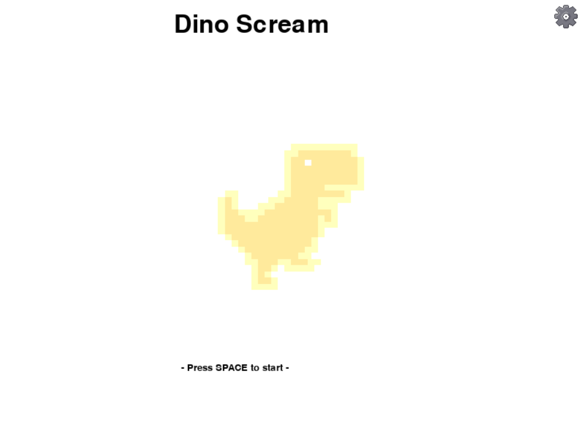

# DinoScream

<!-- markdownlint-disable-next-line MD033 -->
<p align="center">
    <!-- markdownlint-disable-next-line MD033 -->
    
</p>

The game that you might play in the past when you were a kid during internet cutoff. This game is similar to the original one but I implement the some simple logic to integrate with hardware like sound module, gyro. The main move is using your voice to control the jump of the dinosaur that why using name DinoScream and i create the mechanic that can moving forward and backward during the game. The difficulty of this game will increase by the score of the game that increase overtime so pls enjoy my simple game project that trying to integrate with the hardware in raspberry pi board.

## Require Hardware

- Raspberry PI (for playing the game)
- Arduino (for receiving the analog signal from the sound sensor module)
- KY-037 (for sound sensor)
- MPU6050 (for gyro tilting move and crouching mechanic)
- Switch (for select the menu)
- Breadboard (for wire connection)

## Usage

Cloning this repository to your computer

```bash
    git clone https://github.com/plscallMeAlex/DinoScream.git
```

For developer who wants to try this game pls make sure you have pygame in venv or local as you want.

For using the virtual environment

```bash
    python -m venv venv
```

Entering the virtual environment

```bash
    source venv/bin/activate
```

Then install package.

```bash
    pip install requirements.txt
```

For using the local just do then above without connecting to the virtual environment
